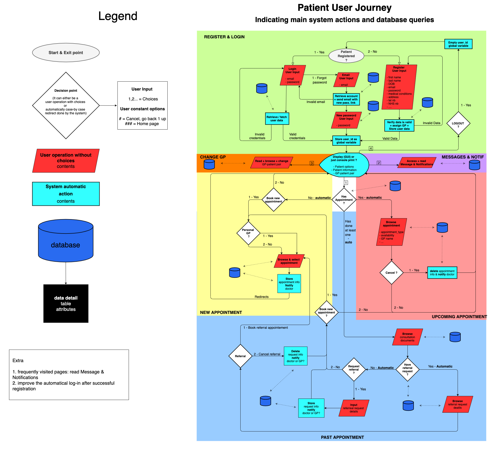
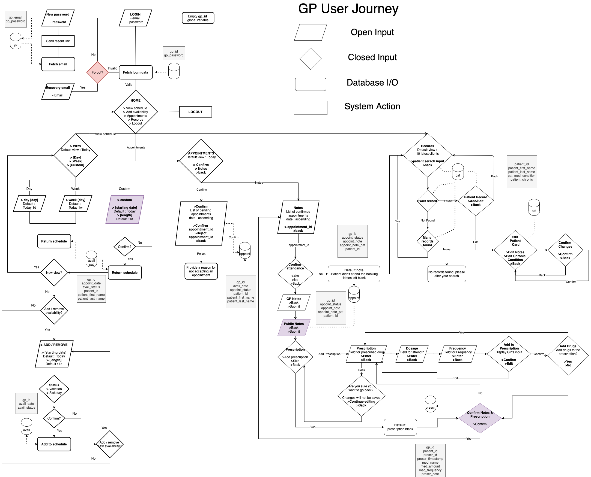
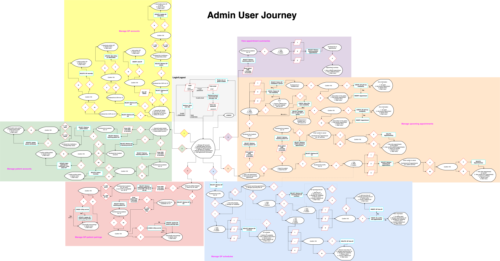
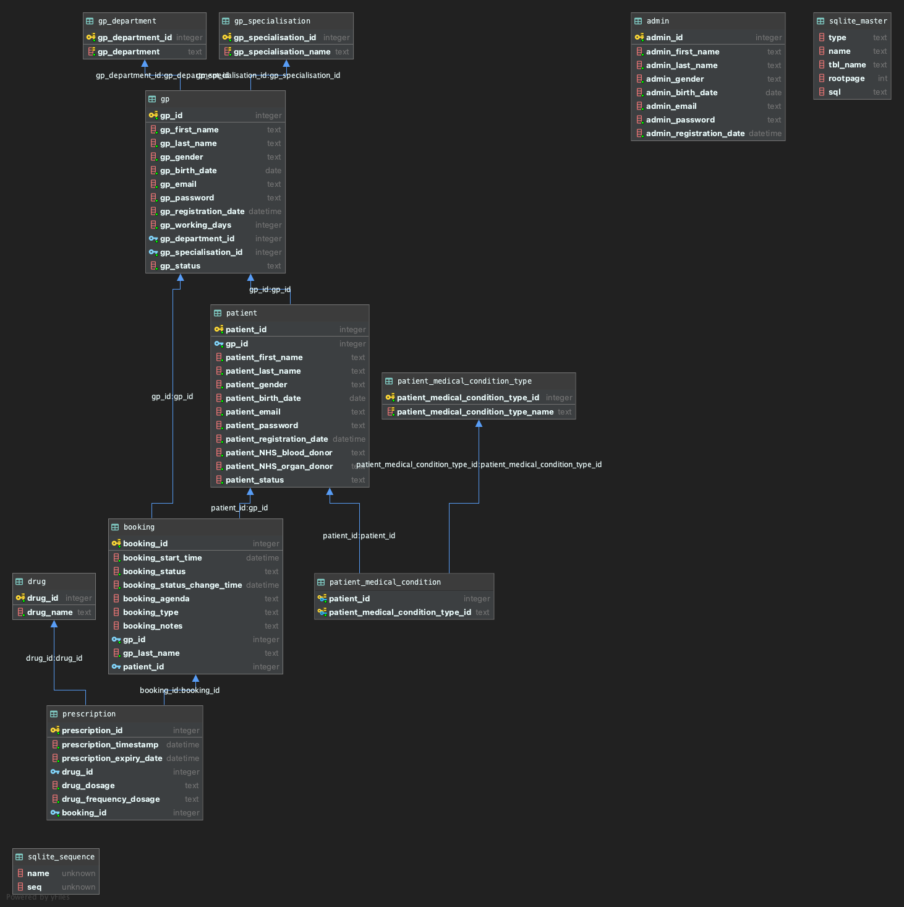

# Prologue


# Table of content 

# (STRUCTURE PREVIEW NOW, NEED DELETION)

- [Prologue](#prologue)
- [Table of content](#table-of-content)
- [(STRUCTURE PREVIEW NOW, NEED DELETION)](#structure-preview-now-need-deletion)
- [Key information](#key-information)
  - [Library dependencies](#library-dependencies)
  - [Running the program](#running-the-program)
  - [Test accounts](#test-accounts)
  - [SQLite database](#sqlite-database)
- [Development](#development)
  - [User experience diagrams](#user-experience-diagrams)
  - [Entity relationship diagram](#entity-relationship-diagram)
  - [Class diagrams](#class-diagrams)
  - [Extensibility](#extensibility)
- [Program design](#program-design)
  - [Classes](#classes)
    - [Outline](#outline)
      - [Return Variables](#return-variables)
      - [Further Information](#further-information)
    - [Appointment](#appointment)
    - [GP](#gp)
    - [Patient](#patient)
    - [Prescription](#prescription)
    - [Record](#record)
    - [Schedule](#schedule)
    - [User](#user)
  - [Database](#database)
    - [Why SQLite?](#why-sqlite)
    - [Database description](#database-description)
    - [Dummy data](#dummy-data)
  - [Database execution](#database-execution)
    - [Taking database down](#taking-database-down)
    - [Initializing database](#initializing-database)
  - [Menu navigation](#menu-navigation)
- [Individual documentation](#individual-documentation)
- [Statistics](#statistics)


# Key information

For a better reader experience, we recommend opening the following information on your browser by clicking [here](https://mattljones.github.io/COMP0066_Coursework/).


## Library dependencies

- Pandas
- Tabulate


## Running the program

By using this project, run `python e_health_main.py` in your terminal.

Open your terminal in full screen for a better user experience.


## Test accounts

In order to 

[Testing accounts' data](/docs/test_data.md)

## SQLite database
When downloading the zip file of this project, the database is already initialized. However, it is possible to perform the below mentioned actions via running the explicit scripts. <br> 
The database must be systematically taken down before being initialized.
- **Taking the database down**: please run [down_db.py](config/down_db.py)
- **Initializing the database**: please run [initialize_db.py](config/initialize_db.py)


# Development 

## User experience diagrams











## Entity relationship diagram




## Class diagrams


## Extensibility

Implemented - 
- Different GP types (for referrals in the future)
- Different GP departments (allowing scalability in the future)
- Patients & gps can be deactivated (option in the DB)

Future work - 
- API to 3Ps e.g. for referring to other hospitals, disease management (anonymous data sharing), sending prescriptions to pharmacies
- Adding 'treatments'/'procedures' functionality e.g. small in-house surgeries, vaccinations, etc.
- Messaging from hospital to patient e.g. automated appointment reminders, notifications of e.g. lab results coming in, etc.


# Program design

## Classes

### Outline

In the following section the different class methods are described in detail, including:
- Name
- Type
- User flow & purpose
- Parameters
- Return objects


#### Return Variables

Some methods (i.e. most CrUD methods) do not return anything. 

Others (i.e. cRud) by definition do return something. For these:

- <b>Optional:</b>
  - Instance for factory methods
  - Booleans describing whether something: 
    - is possible <i>e.g. checking possibility of adding timeoff without conflict</i>
    - was successful <i>e.g. deleting a GP given hospital must have capacity for their patients/upcoming confirmed appointments</i>

- <b>Mandatory:</b>
  - df_object (raw dataframe, for use in user flows (e.g. validating user input))  
  - df_print (to_markdown formatted dataframe, for printing in the terminal)


#### Further Information

Consult the classes themselves for additional information.

Each method has a docstring describing its purpose, parameters and return values, as well as how various <b>edge cases</b> are handled.  


### Appointment

| Name | Type | User flow & purpose | Parameters | Returns |
| ---- | ---- | ------------------- | ---------- | ------- |
| book | instance | <li><b>Admin, Patient</b> <li>Booking an appointment from an instance (instance created in user flow) | - | - |
| update | instance | <li><b>Admin, GP</b> <li> Updating an appointment's details (technically overriding every DB attribute w/ instance values) | - | - |
| select | factory | <li><b>Admin, GP</b> <li> Generating an instance of an appointment to later update attributes based on user input | <li>booking_id | <li>Appointment instance <li>DF incl. indexing of all appointment attributes (not incl. prescription) |
| select_GP | static | <li><b>Admin, GP</b> <li> Getting a list of a GP's appointments in a given time period | <li>type = day/week <li>gp_id <li>[time parameters] | <li>DF of a specific GP's appointments for an upcoming day (detailed) or week (less detailed per day) |
| select_GP_pending | static | <li><b>GP</b> <li> Getting a list of a GP's pending (awaiting confirmation) appointments | <li>gp_id | <li>DF of a specific GP's pending appointments incl. all relevant attributes (sorted by booking_start_time ASC) |
| select_patient | static | <i>Used in Record.select() method</i> | <li>patient_id <li>timeframe ('previous'/'upcoming') <li>status = None (can be 'confirmed' for a specific DF for Record) | <li>DF of a specific patient's previous and upcoming appointments depending which one we need. DF is displayed with Appointment relevant information for a specific Patient (incl. ID and other relevant attributes) |
| select_availability | static | <li><b>Admin, Patient</b> <li> Getting a specific GP's availability before booking an appointment | <li>type = day/week <li>gp_id <li>[time parameters] start date specifically | <li>DF incl. indexing of a specific GP's availability for an upcoming day (detailed) or week (less detailed per day). DF shows times when the GP is unavailable and proved indexes to select from and book an appointment <br><i>NB: in user flow, to 'check' for availability count rows in DF</i> |
| select_other_availability | static | <li><b>Admin, Patient</b> <li> Getting alternative GP availabilities when a patient's own GP has none before booking an appointment | <li>type = day/week <li>gp_id <li>[time parameters] | <li>DF incl. indexing w/ <b>all other GPs'</b> (i.e. with gp_id not equal to the gp_id parameter passed) availability for an upcoming day (detailed) or week (less detailed per day) <br><i>NB: in user flow, to 'check' for availability count rows in DF |
| change_status | static | <li><b>Admin, Patient, GP</b> <li> Changing status for different reasons e.g. cancelling, confirming, rejecting | <li>booking_id <li>new_status | - |
| confirm_all_GP_pending | static | <li><b>GP</b> <li> Confirming all pending appointments | <li>gp_id | - |


### GP

| Name | Type | User flow & purpose | Parameters | Returns |
| ---- | ---- | ------------------- | ---------- | ------- |
| insert | instance | <li><b>Admin</b> <li> Inserting a new GP from an instance populated by user input (GPs cannot register themselves; instance created in user flow) | - | - |
| update | instance | <li><b>Admin</b> <li> Updating a GP's details (technically overriding every DB attribute w/ instance values) | - | - |
| select | factory | <li><b>Admin</b> <li> Generating an instance of a GP to later update attributes based on user input | <li>gp_id | <li> GP instance <br><br> Generally: DF incl. indexing of all of a GP's attributes (except password) <li> df_object <li> df_print |
| select_list | static | <li><b>Admin</b> <li>List of GPs to choose from (used in multiple branches) | <li>type = all/active/not_full | Generally: DF of all relevant GPs {gp_id, name (Dr. + gp_last_name), gp_birth_date, no. patients (if type = 'not_full'; sort column)} <li> df_object <li> df_print |
| select_table | static | <li><b>Admin</b> <li> List of GP departments/specialisations for reference when updating | <li>type = department/specialisation | Generally: DF of relevant DB table <li> df_object <li> df_print |
| reallocate_patients | static | <i>Used in GP.change_status() and GP.delete() methods</i> | <li>gp_id | <li>BOOL True (successful) or False (unsuccessful) <li> Failure details (see docstring and method) |
| reallocate_appointments | static | <i>Used in GP.change_status() and GP.delete() methods</i> | <li>gp_id | <li>BOOL True (successful) or False (unsuccessful) <li> Failure details (see docstring and method) |
| change_status | static | <li><b>Admin</b> <li> Changing a GP's status (to inactive/active) | <li>gp_id <li>new_status | <li>BOOL True (successful) or False (unsuccessful) <li> Failure details (see docstring and method) |
| delete | static | <li><b>Admin</b> <li> Deleting a GP | <li>gp_id | <li>BOOL True (successful) or False (unsuccessful) <li> Failure details (see docstring and method) |


### Patient

| Name | Type | User flow & purpose | Parameters | Returns |
| ---- | ---- | ------------------- | ---------- | ------- |
| update | instance | <li><b>Admin</b> <li> Updating a patient's details (technically overriding every DB attribute w/ instance values) | - | - |
| select | factory | <li><b>Admin, Patient</b> <li> Generating an instance of a patient to later update attributes based on user input | <li>patient_id | <li>Patient instance <br><br> Generally: DF incl. indexing of all of a patient's attributes (except password, and medical conditions neither as that's for GPs to edit) <li> df_object <li> df_print |
| select_list | static | <li><b>Admin</b> <li> List of patients to choose from (used in multiple branches) | <li>type = pending/matching <li>if matching, patient_last_name | Generally: DF of all relevant patients {patient_id, default GP (if type = 'matching'), patient_first_name, patient_last_name, patient_birth_date, patient_registration_date (if type = 'pending'; sort column)} <li> df_object <li> df_print |
| select_gp_details | static | <li><b>Patient</b> <li> Retrieving a patient's default GP ID and name (for booking & sharing with patient) | <li>patient_id | <li>gp_id <li>gp_name |
| change_gp | static | <li><b>Admin, Patient</b> <li> Changing a patient's default GP (checks GP not full first) | <li>type = auto (least full)/specific <li>patient_id <li>if specific, new_gp_id | <li>BOOL True (successful) or False (unsuccessful) <li>new_gp_name (=None if BOOL == False for simpler user flow coding) |
| confirm | static | <li><b>Admin</b> <li> Confirming patients (currently no direct method to change status to 'inactive', but allowed in DB) | <li>type = all/single  <li>if single, patient_id | <i>NB: patients were automatically given a GP during registration to avoid allowing nulls in the DB </i> |
| delete | static | <li><b>Admin</b> <li> Deleting a patient | <li>patient_id | - |


### Prescription

| Name | Type | User flow & purpose | Parameters | Returns |
| ---- | ---- | ------------------- | ---------- | ------- |
| insert | instance | <li><b>GP</b> <li> Inserting a new prescription from an instance populated by user input (instance created in user flow) | - | - |
| select_patient | static | <i>Used in Record.select() method</i> | <li>patient_id | Generally: DF with details of a patient's prescriptions {drug_name, drug_dosage, drug_frequency_dosage, prescription_expiry_date (YYYY-MM-DD), booking_id} whose booking status is "attending"<li> df_object <li> df_print |
| select_drug_list | static | <li><b>GP</b> <li> Getting a list of drugs to choose from (for a prescription) | - | Generally: DF with all drugs {drug_id, drug_name} <li> df_object <li> df_print |


### Record

| Name | Type | User flow & purpose | Parameters | Returns |
| ---- | ---- | ------------------- | ---------- | ------- |
| update | instance | <li><b>GP</b> <li>Updating a patient's medical record (technically overriding every DB attribute w/ instance values) | - | - |
| select | factory | <li><b>Admin, GP</b> <li> Generating an instance of a patient record to later update attributes based on user input. <li> Whilst lots of patient information is displayed, only 'conditions' and 'appointment notes' are editable (assume prescriptions are non-editable/revokable) | <li>patient_id | <li>Record instance <br><br> Generally: <b>2 DFs</b> incl. indexing of all of a patient's 'medical'-related details: 1) attributes & medical conditions 2) previous appointments & corresponding prescriptions <li> df_patient_object <li> df_patient_print <li> df_apps_object <li> df_apps_print |
| select_conditions | static | <li><b>GP</b> <li>List of possible medical conditions for reference when updating patient record | - | Generally: DF of all possible medical conditions <li> df_object <li> df_print |


### Schedule

| Name | Type | User flow & purpose | Parameters | Returns |
| ---- | ---- | ------------------- | ---------- | ------- |
| select | static | <li><b>Admin, GP</b> <li> Viewing a GP's schedule | <li>gp_id <li>type = 'day' or 'week' <li>start_date (YYYY-MM-DD) | Generally: DF of a specific GP's schedule for a given day (detailed: booking_id, booking_agenda, booking_type, (patient_first_name, patient_last_name, patient_id)) or week (less detailed: x-axis: days, y-axis: timeslots) <li> df_object <li> df_print <li> df_print_morning <li> df_print_afternoon  |
| select_timeoff | static | <li><b>Admin</b> <li> Viewing a GP's upcoming timeoff | <li>gp_id <li>type= 'all', 'past' or 'upcoming'  | Generally: DF of a GP's upcoming time off {booking_start_time (YYYY-MM-DD), booking_status} <li> df_object <li> df_print |
| check_timeoff_conflict | static | <li><b>Admin, GP</b> <li> Checking proposed GP timeoff doesn't conflict with any appointments | <li>gp_id <li>date_start (YYYY-MM-DD) <li>date_end (YYYY-MM-DD) | BOOLean: 'True' if there was a conflict, 'False' is there was no conflict <ul><li> boolean</ul> <br /> DF of conflicting appointments {booking_id, booking_start_time, booking_status}    <li> df_object <li> df_print |
| insert_timeoff | static | <li><b>Admin, GP</b> <li> Inserting GP time off (only whole days possible), if there is no conflict according to check_timeoff_conflict | <li>gp_id <li>timeoff_type = 'time off' or 'sick leave' <li>start_date (YYYY-MM-DD) <li>end_date (YYYY-MM-DD) | <li> same return as check_timeoff_conflict |
| delete_timeoff | static | <li><b>Admin, GP</b> <li> Deleting a GP's upcoming time off (e.g if no longer sick, holiday cancelled) (only whole days possible) | <li>gp_id <li>type = 'all' dates or 'custom' date range <li>timeoff_type = 'time off', 'sick leave' or None = 'all' <li>start_date (YYYY-MM-DD, None for type = all) <li>end_date (YYYY-MM-DD, None for type = all) | <li>no return, just deletion |


### User
- Currently no methods (shared GP/Patient instance attributes only)


## Database

### Why SQLite?
We decided to rely on a SQLite database because of the following reasons:
- Seamless functionality within python environment
- Self-containing and serverless database within our project folder
- Taking advantage of database features
- Ensuring that our project is not only an MVP, but also can be used as a scalable foundation for the UCL Hospital

### Database description
For a detailed description of our database, we would like to refer to our ER diagram.

**Important points to mention:**
- booking table  
Used as a calendar for our system. This means that both appointments and time offs of gps get stored.
By default all GPs are available unless they have their weekends (according to gp_working_days,
which is chosen by while registering GPs) lunchtime (based on gp_id: if even lunchtime from 12:00 to 13:00,
else: 13:00 to 14:00). To not unnecessarily fill the database with lunchtimes and weekends, we used an
empty dataframe (for day and week) that accommodates these slots that are not available by default. Using an empty
dataframe and merging it with potential existing appointments or time offs and only enable users in the front
accessing available slots.
- indexes  
There are no separate indexes implemented, as SQLite indexes the primary key of a respective table by default.
As we are using primary keys in our most-used queries, we did not 


### Dummy data
We have created extensive dummy data so that our system can be:
- excessively tested and evaluated by TA and Professor
- our system is ready to showcase and tested by the actual users

Our dummy data is stored [here](config/dummy_data)

## Database execution
The database must be systematically taken down before being initialized.
### Taking database down
Please run [down_db.py](config/down_db.py)
### Initializing database
Please run [initialize_db.py](config/initialize_db.py)


## Menu navigation


# Individual documentation

- [Developing Guidance](/docs/developing.md)
- [Class Document](/docs/classes.md)


# Statistics

```powershell
-------------------------------------------------------------------------------
Language                     files          blank        comment           code
-------------------------------------------------------------------------------
Python                          18           1505           2301           4227
Markdown                         9            343              0            573
XML                              6              0              0             95
-------------------------------------------------------------------------------
SUM:                            33           1848           2301           4895
-------------------------------------------------------------------------------
```